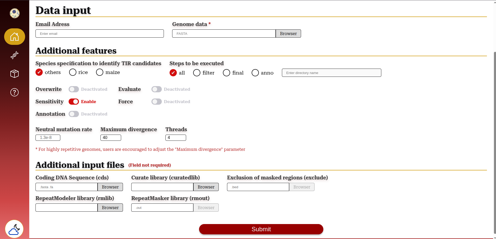

<div align="center"> 
    
</div><br>

<div align="center">

       

</div>


## Table of Contents
  - [Introduction](#introduction)
  - [Installation](#installation)
  - [Exploring the EDTAGUI Interface](#exploring-the-edtagui-interface)
    - [EDTA](#edta)
    - [panEDTA](#panedta)
    - [Results](#results)
  - [Testing](#testing)
  - [Docker](#docker)
  - [Outputs](#outputs)
  - [Citations](#citations)

## Introduction
This package was developed as an extension of the [EDTA pipeline](https://github.com/oushujun/EDTA), with the aim of providing a graphical interface for users. The purpose of EDTAGUI is to make the use of EDTA more accessible, meeting the needs of researchers at different levels of experience – from beginners to experts – and facilitating the analysis and annotation of transposable elements in genomes.


## Installation
**Step 1 - Prrequisites:** Ensure that Miniconda ins installed on your machine:
* You can download it from the following link: [Miniconda3](https://docs.conda.io/projects/miniconda/en/latest/) 
* After downloading Miniconda from the link above, run the following command in your terminal:
 ```sh
 bash Miniconda3-latest-Linux-x86_64.sh
 ```
**Step 2 - Conda Environment:** The installation of EDTAGUI is similar to that of EDTA, with the addition of a few extra packages via Conda and pip to support the graphical interface.
```sh
cd $HOME/EDTA

conda env create -f EDTA_2.2.x.yml
conda activate EDTA
```

> [!IMPORTANT]
> The default name of the Conda environment used is <b>EDTA</b>
><br>
> If you used a different name, you will need to edit the ``main.py`` file located in the ``gui`` folder.
> <br>
> Look for the following lines:
> * "conda activate EDTA" or "$HOME/miniconda3/envs/EDTA/"
> <br>
> And replace EDTA with the name of your environment

>[!TIP]
>**Integration with existing EDTA:** If you already have EDTA installed:
>* You can move the ``gui folder`` into the EDTA directory, or
>* Use the same Conda environment created earlier.
><br>
>
>In the latter case, you will only need to install the following additional packages:
>* Flask packages: ``flask`` / ``flask-email`` / ``flask-pymongo`` / ``flask-script`` / ``python-dotenv``

**Step 3 - Graphical User Interface:**  With the Conda environment active, navigate to the ``gui folder``. Inside this folder, you can create a ``.flaskenv`` file, which defines essential Flask settings and can optionally enable the email notification feature.
```sh
cd $HOME/EDTA/gui
```

* You can create the ``.flaskenv`` file with the following content:
```sh
FLASK_APP = "main.py"
FLASK_DEBUG = True
FLASK_ENV = development
```
**Step 4 - Email:** The interface architecture is designed to ensure continuous user monitoring during execution by offering an <b>optional</b> ``email notification system``. When enabled, EDTAGUI automatically sends updates about the start and completion of analyses, as well as any errors that may occur.
* If you plan to use the built-in email system (for notifications), you should also include the following configuration in your ``.flaskenv`` file:

```sh
MAIL_SERVER=smtp.example.com
MAIL_PORT=587
MAIL_USE_TLS=True
MAIL_USE_SSL=True
MAIL_USERNAME=your_email@example.com
MAIL_PASSWORD=your_app_password
```
> [!TIP]
> <b> Email Server Settings: </b>
> * Gmail:
>   * Server: smtp.gmail.com 
>   * Port: 587 (TLS) or 465 (SSL) 
> * Outlook: 
>   * Server: smtp.office365.com
>   * Port: 587 (TLS)
> <br>
>
> <b>App Password for Gmail:</b> <br>
> To use Gmail securely, create an app-specific password:
> 1. Open your Google Account settings.
> 2. Search for "App Passwords" in the search bar.
> 3. Generate a new app password and use it in the MAIL_PASSWORD field.

<br>

> [!WARNING]
> <b> Security Recommendations: </b>
> * Avoid using your primary email account. You can use a dedicated email address for application use.
> * <b>Never share your ``.flaskenv`` file</b> or expose it in public repositories, as it contains sensitive credentials.

**Step 5 - Run the Application:** Within the ``gui`` folder, and with the Conda environment activated, start the application by running the following command:
```sh
flask run
```

If all settings are correct, you will see a message similar to this:
```sh
 * Serving Flask app 'main.py' (lazy loading)
 * Environment: development
 * Debug mode: on
 * Running on http://127.0.0.1:5000/ (Press CTRL+C to quit)
 * Restarting with stat
 * Debugger is active!
 * Debugger PIN: 264-075-516
```

**Step 6 - Access the Platform:** Click on the link http://127.0.0.1:5000/, or copy and paste it into your browser to access the platform and start testing it.


## Exploring the EDTAGUI Interface
The EDTAGUI interface was developed to implement, as closely as possible, all the functionalities available in the traditional EDTA pipeline, but in a more accessible way through a graphical interface.

The interface is divided into four main sections: EDTA, panEDTA, Result, and Help.

### EDTA

<div align="center">
    
</div>

This section replicates several fields from the original EDTA pipeline, organising them into subareas to facilitate the annotation process and improve the user experience.

Data input begins with the following fields:

* **Email Address:** To start the annotation process, enter a valid email address. This is a optional field and is used to send notifications about the status of the analysis. While the email facilitates communication, the annotation occurs locally, so keep the system running during the process.
* **Genome Data:** Upload the input file containing the complete genomic sequence in FASTA format. Use the "Browse" button to select the file from the local system.

Next, the interface presents additional features, grouped into a subsection with advanced configuration options for the analysis.
* **Species Specification to Identify TIR Candidates:** Allows users to specify the reference species in order to optimise the identification of TIR elements. The options include:
  * Others: For species other than rice or maize (default).
  * Rice: For rice genomes.
  * Maize: For maize genomes.

* **Steps to Be Executed:** Select which parts of the pipeline will be executed:
  * All: Runs the entire pipeline (default).
  * Filter: Starts from raw TEs to the end.
  * Final: Begins with filtered TEs to completion.
  * Anno: Conducts genome-wide annotation after building the TE library.

  When selecting the Filter, Final, or Anno options, it is necessary to specify the name of the folder where a previous annotation step has already been executed. This folder must be located within the /EDTA/gui/results directory. This ensures that EDTAGUI can access the required files to continue the process, reusing the data already generated and avoiding the repetition of previous steps.

* **Overwrite:** Decide whether existing output data should be overwritten.
* **Sensitivity:** Control the execution of RepeatModeler to identify additional elements.
* **Annotation:** Specify whether the genome-wide annotation of TEs should proceed after building the TE library.
* **Evaluate:** Check if the classification of annotated TEs is consistent. The "Annotation" field must be enabled to use this feature.
* **Force:** If no reliable TE candidates are identified, enabling this option allows the script to continue using a backup rice TE library.
* **Neutral Mutation Rate:** Set the neutral mutation rate for calculating the age of intact LTR elements (default: 1.3e-8 bp per year, based on rice).
* **Maximum Divergence:** Define the maximum acceptable divergence for TE fragments. For highly repetitive genomes, users are encouraged to adjust the parameter (default: 40).
* **Threads:** Determine the number of threads to be used in running the pipeline (default: 4).
  
Finally, there is a section dedicated to additional input files, allowing users to include complementary files to streamline and enhance the analysis.
* **Coding DNA Sequence:** Select a FASTA file containing the coding sequence (without introns, UTRs, or TEs) of the genome or a close relative. This helps in excluding non-transposable elements.
* **Curate library:** Upload a curated library to maintain consistent TE naming and classification. Only manually validated TEs should be provided. This file is optional.
* **Exclusion of masked regions:** Define regions to be ignored during TE masking. The "Annotation" field must be enabled to use this option.
* **RepeatModeler library:** Upload a classified RepeatModeler library to enhance analysis sensitivity, particularly for LINEs. If not provided, one will be generated automatically.
* **RepeatMasker library:** Provide your own homology-based TE annotation in RepeatMasker .out format. This file will be merged with the structure-based annotation. The "Annotation" field must be enabled.


### panEDTA

<div align="center">
    
</div>

This section provides the interface for panEDTA, a new feature of the EDTA pipeline that enables sequential annotation of multiple genomes.

Data input begins with the following fields:
* **Email Address:** To start the annotation process, enter a valid email address. This is a optional field and is used to send notifications about the status of the analysis. While the email facilitates communication, the annotation occurs locally, so keep the system running during the process.

* **Genome Data:** Upload the input file containing the complete genome sequence in FASTA format, along with a corresponding CDS file (optional). You must provide at least one genome file. The optional CDS file will only be considered if it is linked to a genome; otherwise, it will be ignored. Use the Browse button to select files from your local system. By clicking the "+" icon, you can add more fields to upload additional genome and CDS files.

Next, the interface presents additional features, this subsection provides advanced configuration options for the analysis.
* **Coding DNA Sequence:** Required. A coding sequence file in FASTA format. The CDS file provided in this field will be used to fill in any missing CDS files from the Genome Data list. If no CDS files are specified in the genome list, this CDS file will be applied to all genomes.

* **Non-redundant library:** Optional. A manually curated non-redundant library following the RepeatMasker naming convention.

* **Threads:** Specify the number of threads to be used when running panEDTA (default: 10).

* **Minimum number of full-length TE copies in individual genomes:** Defines the minimum number of full-length TE copies required in individual genomes for them to be considered as candidate TEs for the pangenome. Lower values are more inclusive, resulting in a larger library, higher sensitivity, but increased inconsistency. Higher values are more stringent, leading to a smaller library, reduced sensitivity, and greater consistency. (default: 3).

### Results
After completing all necessary fields, click "Submit" to start the analysis. Ensure that all configurations are correct for efficient and accurate processing.

If you have provided a valid email address, you will receive a notification once the annotation process has started. Upon completion, a second email will be sent, indicating whether the process was successful or if any issues occurred. This final email will include a detailed log file outlining the outcome.

You can also monitor the progress of the annotation by accessing the "Results" tab. This section displays key information such as:
  * The name of the generated output file;
  * Start and end timestamps (when available);
  * The current status of the annotation (e.g., in progress, completed, failed);
  * The last 20 lines of the annotation log.

**Note 1:** all results and output files will be stored in the Docker volume you specified as the output directory. Ensure this path is correctly mounted to access the generated data.

**Note 2:** Errors may occasionally occur during the annotation process, so it is important to pay attention to two key stages:

  * **1.** Start of annotation: After uploading a file, ensure that the annotation process has actually begun. Sometimes, the file may not be properly recognised by the system, and in such cases, you will need to re-upload the file and restart the process.

  * **2.** Completion of annotation: Even if the process runs, the annotation may not be successfully finalised in the Results section. Therefore, it is important to check the following:

    * Look out for any prolonged error messages.
    * Confirm whether the message <i>"Evaluation of TE annotation finished! ..."</i> or <i>"panEDTA annotation of genome_${date}.cds.list is finished!"</i> appears — this message indicates that the annotation has been successfully completed.

### Help
Provides a brief guide explaining each option available in the annotation sections.

## Testing
You should test the EDTA pipeline with a 1-Mb toy genome, which takes about five mins. If your test finishs without any errors (warnings are OK), then EDTA should be correctly installed. If the test is OK but you encounter errors with your data, you should check your own data for any formating/naming mistakes.

Step-by-step:

**1.** Genome data: Select the genome.fa file located in the /EDTA/test folder.

**2.** Activate the options: Overwrite, Annotation, and Sensitivity (These options are enabled by default in the graphical interface).

**3.** Threads: Define the number of threads you wish to use for processing.

**4.** Coding DNA Sequence (CDS): Add the genome.cds.fa file, also located in /EDTA/test.

**5.** Curate library: Select the rice7.0.0.liban file, available in the /EDTA/database folder.

**6.** Exclusion of masked regions: Specify the genome.exclude.bed file, also found in /EDTA/test.

**7.** After completing all fields, click <b>Submit</b> to start the pipeline execution.

## Outputs
After completion, all results are organised in the /EDTA/gui/results directory. The folders generated by the annotation process in the EDTA section are named according to the genome name, the date (year, month, day), and the time (hour, minute, second) of execution. The folder generated by the panEDTA section follows the same naming pattern but starts with the prefix panGenome.

## Docker
> [!IMPORTANT] 
> <b> Prerequisites </b> <br>
> - 🐳 [Docker](https://docs.docker.com/engine/install/)

>[!TIP] 
> If you intend to use the email notification system, please note that <b>your machine must have access to the internet</b> for this feature to function properly.

Open the terminal and run the following commands:

**Step 1. Download the EDTA Image:** Open your terminal and run the following command to download the EDTA Docker image:
```sh
docker pull annotep/edtagui:v1
```

**Step 2. Run the Container** Next, run the container using the command below. Specify a folder on your machine to store the annotation results:
```sh
docker run -it -v <path-to-results-folder>:/usr/local/EDTA/gui/results -dp 0.0.0.0:5000:5000 annotep/edtagui:v1
```
> [!TIP]
> ### Description:
> - ``-v <path-to-results-folder>:/usr/local/EDTA/gui/results``: Creates a volume between your machine and the container to store results. Replace ``-v <path-to-results-folder>`` with the path to a folder on your machine. If the folder doesn't exist, Docker will create it. The path ``/usr/local/EDTA/gui/results`` is the directory inside the container and should not be changed.
> - ``-dp 0.0.0.0:5000:5000``: Maps port 5000 on the container to port 5000 on your machine.
> - ``annotep/edtagui:v1``: Specifies the Docker image to use.
> <br>


**Step 3. Acess the EDTA interface:** After running the container, access the EDTA interface by typing the following address into your web browser:``127.0.0.1:5000``

<br>

Once the process is complete, you will receive an email confirming whether it finished successfully or with errors. The email will include:

* The name of the generated folder (available in the results directory specified via ``-v <path-to-results-folder>``);
* A detailed ``log`` of the annotation steps;

>[!IMPORTANT]
> * **Avoid shutting down your machine during the process**, as this may interrupt the analysis. Even when using the web interface, processing occurs locally on your machine.
> * **Annotation speed depends on your machine's performance.** Ensure your system meets the recommended requirements for optimal results.


## Citations
This work is an extension of the EDTA tool. Therefore, when using EDTAGUI in publications or projects, please cite the following original articles:

Ou S., Su W., Liao Y., Chougule K., Agda J. R. A., Hellinga A. J., Lugo C. S. B., Elliott T. A., Ware D., Peterson T., Jiang N.✉, Hirsch C. N.✉ and Hufford M. B.✉ (2019). Benchmarking Transposable Element Annotation Methods for Creation of a Streamlined, Comprehensive Pipeline. [Genome Biol. 20(1): 275.](https://genomebiology.biomedcentral.com/articles/10.1186/s13059-019-1905-y)

Ou S., Scheben A., Collins T., Qiu Y., Seetharam A., Menard C., Manchanda N., Gent J., Schatz M., Anderson S., Hufford M.✉, Hirsch C.✉ (2024). Differences in activity and stability drive transposable element variation in tropical and temperate maize. [Genome Research](https://doi.org/10.1101/gr.278131.123)